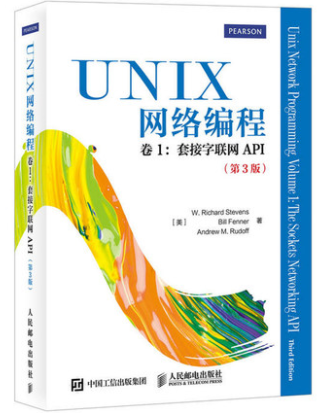

# 《UNIX网络编程 卷1：套接字联网API（第3版）》学习笔记

### UNP(UNIX Network Programming Volume1:The Socket Networking API)

---

## 本仓库内容

1. 《UNIX网络编程·卷1：套接字联网API（第3版）》的源码仓库
2. 《UNIX网络编程·卷1：套接字联网API（第3版）》学习笔记

```
Something I hope you know before go into the coding~
First, please watch or star this repo, I'll be more happy if you follow me.
Bug report, questions and discussion are welcome, you can post an issue or pull a request.
```
## 相关站点

* GitBook地址:<https://yifengyou.gitbooks.io/learn-unp1/content/>

* GitHub地址:<https://github.com/yifengyou/learn-unp1>


## 参考书目



《UNIX网络编程卷1：套接字联网API（第3版）》是一部UNIX网络编程的经典之作！书中全面深入地介绍了如何使用套接字API进行网络编程。全书不但介绍了基本编程内容，还涵盖了与套接字编程相关的高级主题，对于客户/服务器程序的各种设计方法也作了完整的探讨，最后还深入分析了流这种设备驱动机制。

《UNIX网络编程·卷1：套接字联网API（第3版）》内容详尽，几乎每章都提供精选的习题，并提供了部分习题的答案，是网络研究和开发人员理想的参考书。


## 目录

* [learn-unp1](README.md)
* [第1章-简介](docs/第1章-简介/第1章-简介.md)
* [第2章-传输层=tcp+udp+sctp](docs/第2章-传输层=tcp+udp+sctp/第2章-传输层=tcp+udp+sctp.md)
* [第3章-套接字编程简介](docs/第3章-套接字编程简介/第3章-套接字编程简介.md)
* [第4章-基本tcp套接字编程](docs/第4章-基本tcp套接字编程/第4章-基本tcp套接字编程.md)
* [第5章-tcp客户服务器程序示例](docs/第5章-tcp客户服务器程序示例/第5章-tcp客户服务器程序示例.md)
* [第6章-io复用=select和poll函数](docs/第6章-io复用=select和poll函数/第6章-io复用=select和poll函数.md)
* [第7章-套接字选项](docs/第7章-套接字选项/第7章-套接字选项.md)
* [第8章-基本udp套接字编程](docs/第8章-基本udp套接字编程/第8章-基本udp套接字编程.md)
* [第9章-基本sctp套接字编程](docs/第9章-基本sctp套接字编程/第9章-基本sctp套接字编程.md)
* [第10章-sctp客户服务器程序例子](docs/第10章-sctp客户服务器程序例子/第10章-sctp客户服务器程序例子.md)
* [第11章-名字与地址转换](docs/第11章-名字与地址转换/第11章-名字与地址转换.md)
* [第12章-ipv4与ipv6的互操作性](docs/第12章-ipv4与ipv6的互操作性/第12章-ipv4与ipv6的互操作性.md)
* [第13章-守护进程和inetd超级服务器](docs/第13章-守护进程和inetd超级服务器/第13章-守护进程和inetd超级服务器.md)
* [第14章-高级io函数](docs/第14章-高级io函数/第14章-高级io函数.md)
* [第15章-unix域协议](docs/第15章-unix域协议/第15章-unix域协议.md)
* [第16章-非阻塞式io](docs/第16章-非阻塞式io/第16章-非阻塞式io.md)
* [第17章-ioctl操作](docs/第17章-ioctl操作/第17章-ioctl操作.md)
* [第18章-路由套接字](docs/第18章-路由套接字/第18章-路由套接字.md)
* [第19章-密钥管理套接字](docs/第19章-密钥管理套接字/第19章-密钥管理套接字.md)
* [第20章-广播](docs/第20章-广播/第20章-广播.md)
* [第21章-多播](docs/第21章-多播/第21章-多播.md)
* [第22章-高级udp套接字编程](docs/第22章-高级udp套接字编程/第22章-高级udp套接字编程.md)
* [第23章-高级sctp套接字编程](docs/第23章-高级sctp套接字编程/第23章-高级sctp套接字编程.md)
* [第24章-带外数据](docs/第24章-带外数据/第24章-带外数据.md)
* [第25章-信号驱动式io](docs/第25章-信号驱动式io/第25章-信号驱动式io.md)
* [第26章-线程](docs/第26章-线程/第26章-线程.md)
* [第27章-ip选项](docs/第27章-ip选项/第27章-ip选项.md)
* [第28章-原始套接字](docs/第28章-原始套接字/第28章-原始套接字.md)
* [第29章-数据链路访问](docs/第29章-数据链路访问/第29章-数据链路访问.md)
* [第30章-客户服务器程序设计范式](docs/第30章-客户服务器程序设计范式/第30章-客户服务器程序设计范式.md)
* [第31章-流](docs/第31章-流/第31章-流.md)

## 参考博客

## 思维导图


## 总结

```
1. 概念的东西理解记忆
2. 基础永远值得花费90%的精力去学习加强。厚积而薄发~
```
